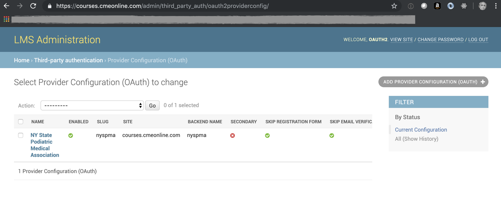
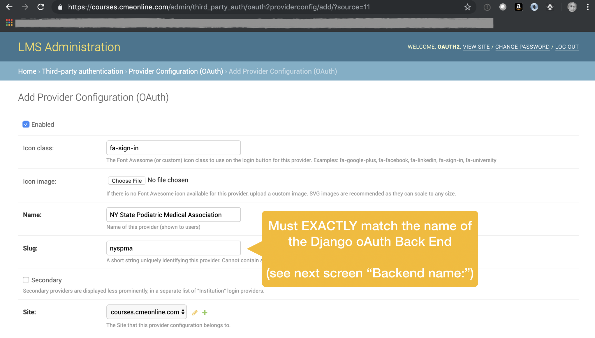
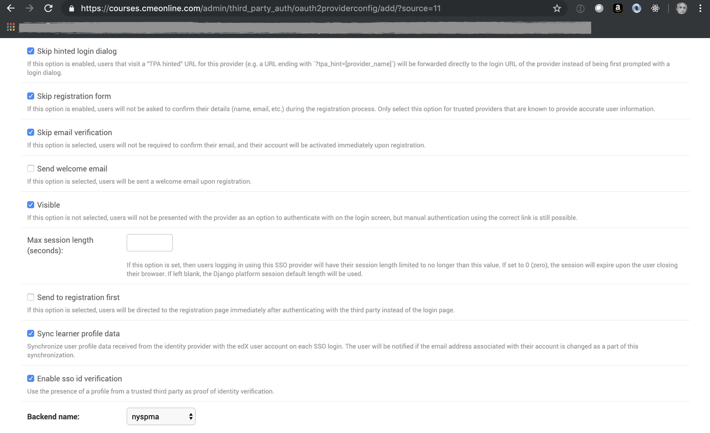
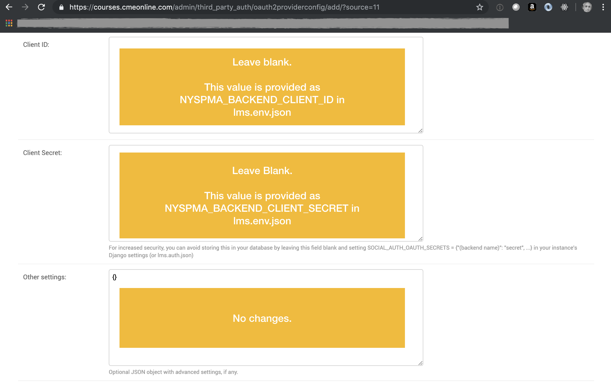

NYSPMA OAuth2 Backend
=============================

Overview
--------

A Python Social Auth backend for NYSPMA, mostly used for Open edX but can be used elsewhere.
This package was originally cloned from https://github.com/appsembler/trinity-oauth-backend.

This package is structured so that it can be uploaded to PyPI and installed using pip or easyinstall.
More detail here: https://python-packaging.readthedocs.io/en/latest/minimal.html

* added Travis.

Installation
--------
The high-level installation process exactly follows the Open edX documentation: Link: https://edx.readthedocs.io/projects/edx-installing-configuring-and-running/en/latest/configuration/tpa/tpa_integrate_open/tpa_oauth.html

**1. Install this repo to an Open edX installation using pip**

::

    sudo -H -u edxapp bash
    source /edx/app/edxapp/edxapp_env
    pip install git+https://github.com/lpm0073/edx-oauth-nyspma.git

    # Verify that installation was successful.
    # Look for pip package: edx-oauth-nyspma (0.1.0)
    pip list installed

This package can alternatively be installed directly from its github repo using syntax as follows:

::

    setup(
    ...
      dependency_links=['https://github.com/lpm0073/edx-oauth-nyspma.git']
    ...
    )

**2. Register the pip package in /edx/app/edxapp/lms.env.json**

::

  "THIRD_PARTY_AUTH_BACKENDS": [
            "edx-oauth-nyspma.olp-bie.OlpOAuth2"
        ]

**3. Set Open edX LMS app feature flags in /edx/app/edxapp/lms.env.json**

::

  "FEATURES" : {
      ...
      "ENABLE_COMBINED_LOGIN_REGISTRATION": true,
      "ENABLE_THIRD_PARTY_AUTH": true
  }

**4. Register a Third Party Authorization configuration profile in Django Admin**

Refer to instructions in edx.readthedocs.io "4.22.3.2.1.1.3. Add the Provider Configuration" on configuring this oAuth consumer. This is a simple form for configuring the appearance of the button face on the login and registration forms on the LMS and AM.

Django model configuration: <LMS URI>/admin/third_party_auth/oauth2providerconfig/

License
-------

The code in this repository is licensed under the MIT License unless
otherwise noted.

Please see ``LICENSE.txt`` for details.

The Backend Dependency on Python Social Auth
--------------------------------------------

The backend depends on Python Social Auth. It is only compatible with the
`new split Python Social Auth
<https://github.com/python-social-auth/>`_
that is being used on Ginkgo and upcoming releases.

SSO Endpoints
-------------
The backend consumes the following URLs:

-  **User Query** ``https://olp-bie.dev.ciservers.net/api/user?``
-  **Registration:** ``https://olp-bie.dev.ciservers.net/register``
-  **Login:** ``https://olp-bie.dev.ciservers.net/oauth/v2/auth/login``
-  ``AUTHORIZATION_URL``:
   ``https://olp-bie.dev.ciservers.net/oauth/authorize``
-  ``ACCESS_TOKEN_URL``:
   ``https://olp-bie.dev.ciservers.net/oauth/token``

When using the ``staging`` environment (see below), the domain
``[ALTERNATE DOMAIN NAME]]`` is used instead.

The OAuth server provides the following information about the user:

- ``email``
- ``username``
- ``first_name``
- ``last_name``
- ``full_name``

Backend Extra Settings
----------------------
In addition to the usual client, secret key and other settings.
This backend requires the ``ENVIRONMENT`` configuration:

::

  SOCIAL_AUTH_ENVIRONMENT = 'staging'  # or 'production'

In Open edX, this is usually set via the admin panel in the backend's **Other Settings** field:

::

  { "ENVIRONMENT": "production" }
